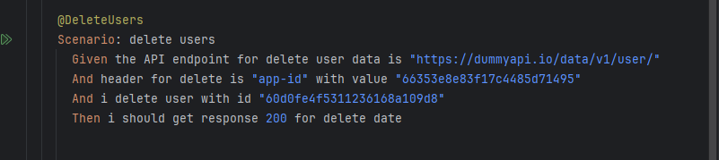

### ./gradlew cucumber -Ptags="@API" --> Running base on tags for api

### ./gradlew cucumber -Ptags="@WEB" --> Running base on tags for Web

### ./gradlew cucumber test --> Running all cucumber test

# Explaination for API Testing

### GetListofTags

@GetListofTags : get all list of tags and the expected is response 200 (OK)

### GetUsersByID

@GetUsersByID : to get user by their ID and compare the result with json schema and expected response is 200 (OK)

and i try to handle another respose wih logic :

- if the response code is 400 and the string is params not valid. I returned response "THATS ID NEVER EXIST"
- If the response code is 404 and the string is resource not found. I returned response "YOU INSERT WRONG ID"
- If the response code is 200. I assert the json response with json schema.

### UpdateUsers

@UpdateUsers : update user identity/ data with paramter id and expected response is 200 (OK)

Logic for handle response:

- if the response code is 400 and the string is params not valid. I returned response "THATS ID NEVER EXIST"
- If the response code is 404 and the string is resource not found. I returned response "YOU INSERT WRONG ID"
- If the response code is 200. I returned string "request match"

### CreateUser

@CreateUser : create user with jsonschema and expected response is 200 (OK)

Logic for handle response:

- If the response code is 400 and the string is "body not valid" and email already used. I return string "email already register. please use other email"
- If the response code is 200. I return string "berhasil"

### DeleteUsers

@DeleteUsers : delete user with paramter user id and if succes the response code is 200 (OK)

Logic for handle response:

- if the response code is 400 and the string is params not valid. I returned response "THATS ID NEVER EXIST"
- If the response code is 404 and the string is resource not found. I returned response "YOU INSERT WRONG ID"
- If status code is 200. I returned response string "Success delete data"

### -------------------------------------------------------------------------------------------------------

# Explaination for Web Testing

## CalculateFinalPrice

### Schenario : calculate final price

- Automation for make sure calculate final price in cart already match with product added.

## LoginValidUser

### Schenario : login with two different valid account

- Automation for make sure if login with user login A and logout, and login again with different account. The profile name at top right will match with login name.

## AddProducttoCart

### Schenario : Add product to cart

- Automation for make sure product added, match with cart

## DeleteProductFromCart

### Schenario : Delete product from cart

- Automation for make sure final price (calculated) will not displayed if all product deleted.

## Field Validation

### Schenario : Validation credit card field

- Usually, credit card field only can input with number. In this automation if credit cart field can be filled with alphabet, this automation is not OK.

### Schenario : validation month value.

- Usually, month field only can inputed with alphabet or number (example : 'january" or "01"). If month value can be filled with combined alphabet and number, this schenario is not OK

### Schenario : validation year value.

- Year field only can be filled with number value. If year field can be filled with alphabet value, this schenario is not OK.

### Schenario : Right value for field

- Filled all field with valid value, and click purchase button. After click purhcase button, popup purchase will appear.

# Github Action Workflow

- Logic for github action work flow is running all web testing with ubuntu.
- Running all web automation first,after running and generate report. I archived that report.
- Running all API automation first,after running and generate report. I archived that report.

## Result Github Action

The result is:

### Automation for web :

failed to build web automation because some schenario does not meet expectations.

### Automation for API :

Success to build.
